# Homework 6

Welcome to homework 6! For this homework, I've been asked to choose from a list of 6 tasks. I have chosen to do tasks 2 and 6. I'll first be creating my own function and will finish up by exploring nested dataframes.

Prompt:
"Write a couple of experimental functions exploring some functionality that is useful to you in real life and that might form the basis of your personal package."

Because I work in the social sciences, I find myself doing a LOT of copy/pasting ggplot2 code for histograms and barplots. These figures constitute 75% of my "exploratory data analysis," so it would be very useful if I could automate this process. My goal then is to create a function that will produce histograms of every variable in any dataframe that I read into R. After some inspection, it seems that generating a function for computing 2x2 barplots of all the variables in a dataset would be quite difficult and ought to be left for a later assignment (perhaps creating my own R package).

Some people might suggest plotting several histograms at once (in a single panel) using various R packages, but I find this clunky. I like being able to look at each variable in isolation. 

First, I'll read in some data. This is a dataset called EWB light that was collected by personality psychologists.


```r
ewb <- read.table("C:/Users/Wade/Dropbox/Psych 546E 2016/Datasets/ewblight.txt", header=TRUE)
head(ewb)
```

```
##      ID MEANDEP MEANINC MEANPFR MEANSEN ACMPLM36 ADISRM36 AEXPRM36
## 1 10032   10.00    1.44   10.50    7.50       18        9       25
## 2 10061   21.75    1.87   11.00    6.50       24       14       33
## 3 10090      NA      NA      NA      NA       NA       NA       NA
## 4 10111      NA      NA      NA      NA       NA       NA       NA
## 5 10122    8.00    0.85    6.75    8.50       20       11       31
## 6 10146      NA    2.02      NA   13.25       26       14       38
##   BEXTSM36 BINTSM36 BKSTDO36
## 1       23       14        5
## 2       15       17        5
## 3       NA       NA       NA
## 4       NA       NA       NA
## 5       19       13        6
## 6       14       10       14
```


```r
suppressPackageStartupMessages(library(tidyverse))
suppressPackageStartupMessages(library(reshape2))
suppressPackageStartupMessages(library(psych))
# Psych is an R package developed for psychologists. It's mostly used to print tables of 
# summary statistics that are commonly used in psychology.
```

For loops follow the following syntax:

for (var in seq) {
  expr
}

That is to say: For each variable in this sequence (or each element in this set), execute this expression.

You can also insert a break statement if you don't want the for loop to be performed on the entire sequence. Ex:

for (var in seq) {
  if (nchar(var) > 10) {
  break
  }
  expr(var)
}
 
You can use "next" instead of break if you want to skip a variable. 


```r
names <- names(ewb)
names(ewb)
```

```
##  [1] "ID"       "MEANDEP"  "MEANINC"  "MEANPFR"  "MEANSEN"  "ACMPLM36"
##  [7] "ADISRM36" "AEXPRM36" "BEXTSM36" "BINTSM36" "BKSTDO36"
```

```r
classes<-sapply(ewb, class)
```


```r
for(name in names) {
 hist(ewb[,name])
}
```

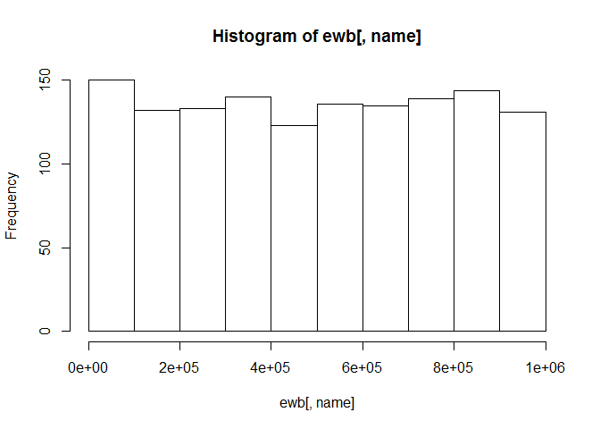<!-- -->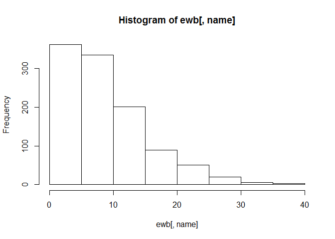<!-- -->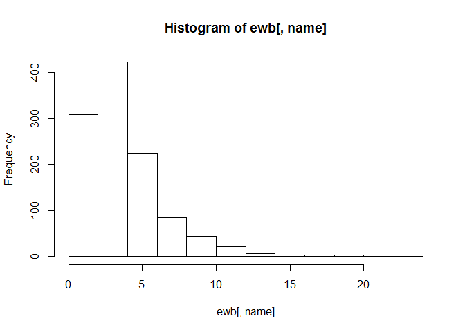<!-- -->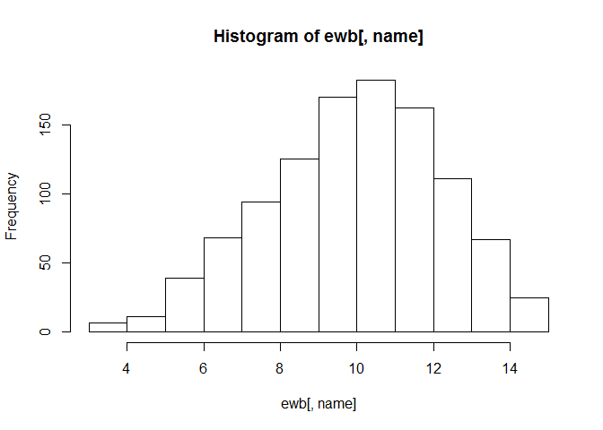<!-- -->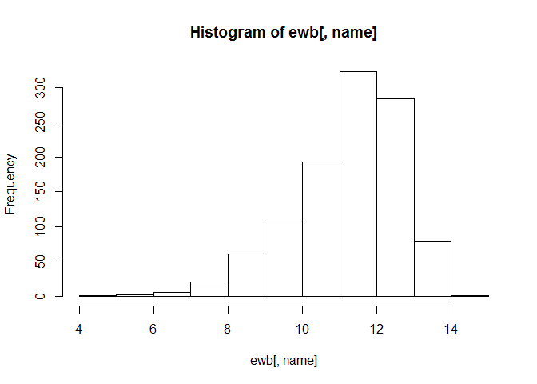<!-- -->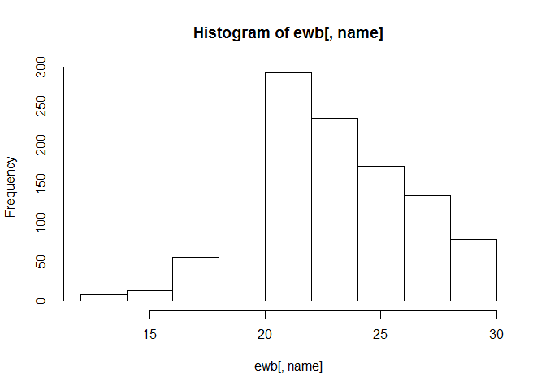<!-- -->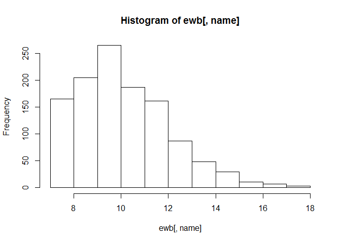<!-- -->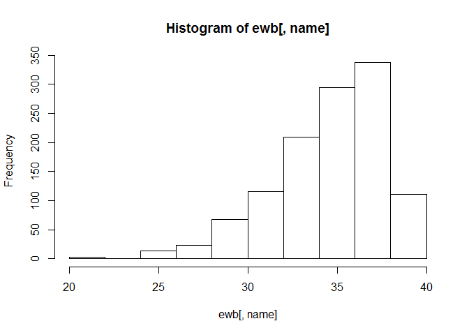<!-- -->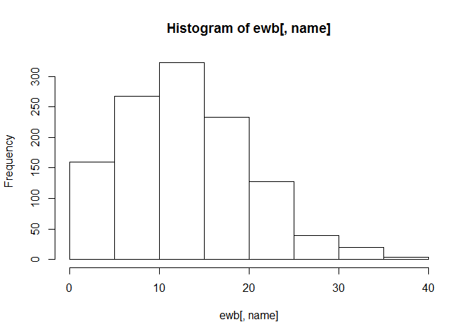<!-- -->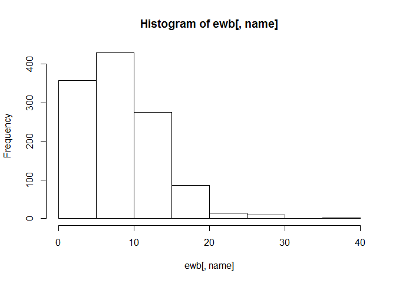<!-- -->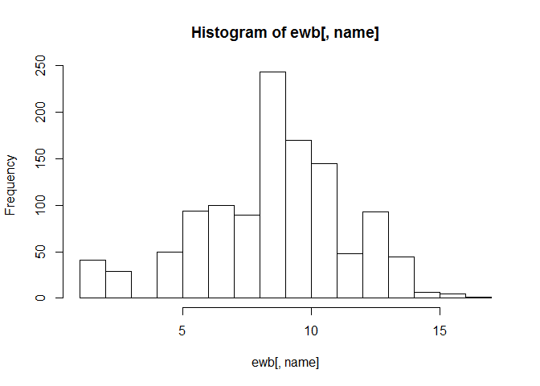<!-- -->

This code appears to work, but the titles are all messed up. I have to use a for loop with a different syntax to put the column names on the graphs.


```r
for (i in 1:11) {
  hist(ewb[,name],
       main = paste(colnames(ewb)[i]),
       xlab = "") 
}
```

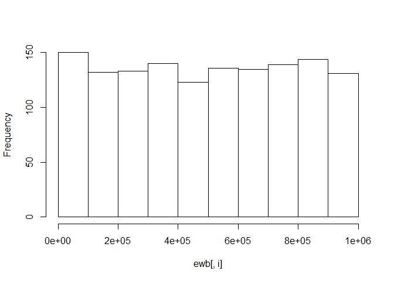<!-- -->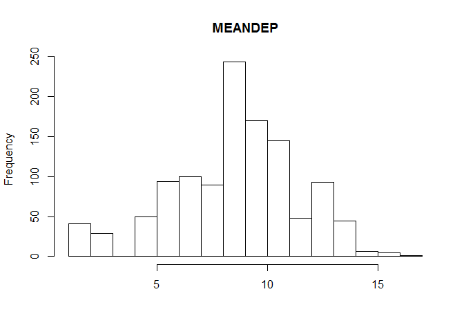<!-- -->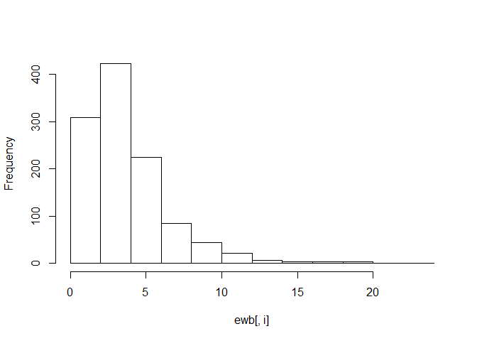<!-- --><!-- -->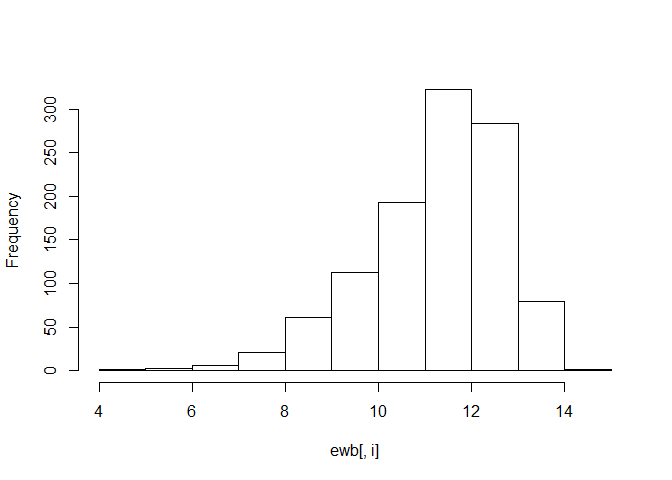<!-- --><!-- -->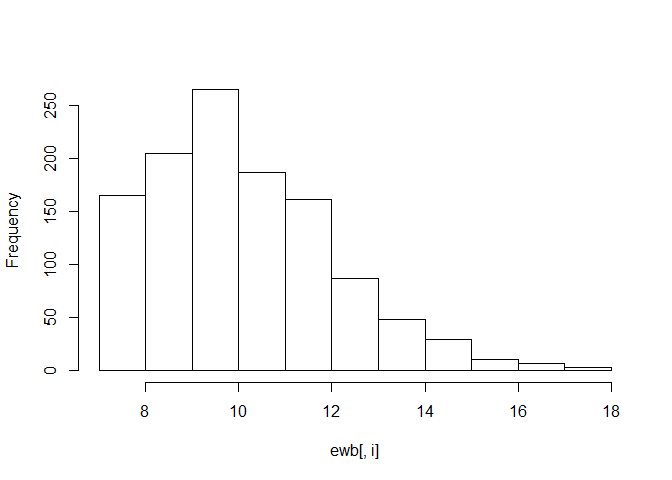<!-- -->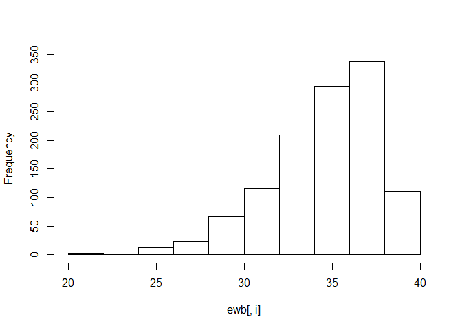<!-- -->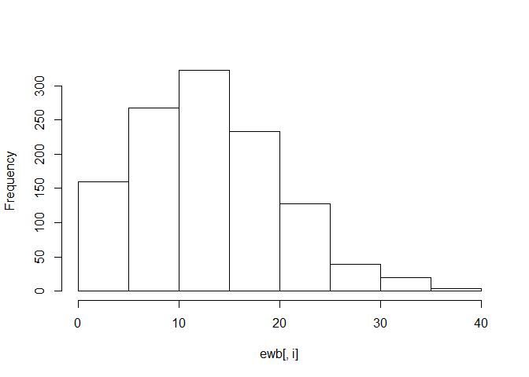<!-- -->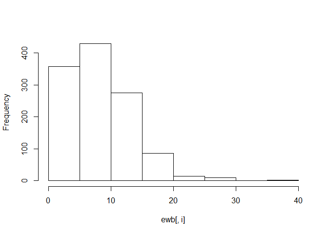<!-- -->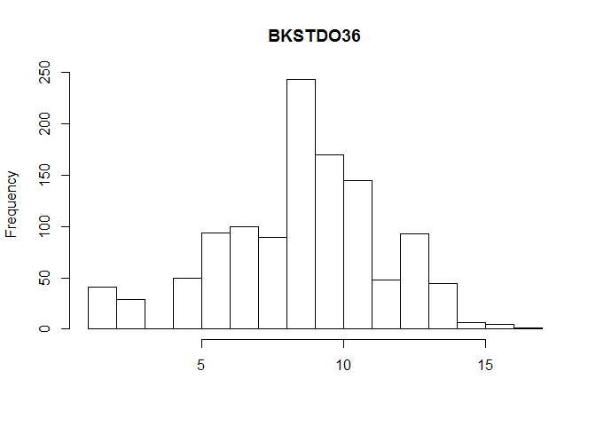<!-- -->

Perfect! Now I have code that will generate histograms for every variable in a dataset. In addition, these histograms will be appropriately labeled based on the column name of the variable being plotted. It may not look like it, but finding the right code for this took me a surprisingly long time.


Now, we will move onto the last task: working with a nested dataframe.


```r
library(broom)
library(gapminder)
#install.packages("digest")
library(digest)
```

First, we will nest the data by country and continent.


```r
nest <- gapminder %>% 
   group_by(continent, country) %>% 
   nest()
head(nest)
```

```
## # A tibble: 6 × 3
##   continent     country              data
##      <fctr>      <fctr>            <list>
## 1      Asia Afghanistan <tibble [12 × 4]>
## 2    Europe     Albania <tibble [12 × 4]>
## 3    Africa     Algeria <tibble [12 × 4]>
## 4    Africa      Angola <tibble [12 × 4]>
## 5  Americas   Argentina <tibble [12 × 4]>
## 6   Oceania   Australia <tibble [12 × 4]>
```

```r
nest$data[[1]]
```

```
## # A tibble: 12 × 4
##     year lifeExp      pop gdpPercap
##    <int>   <dbl>    <int>     <dbl>
## 1   1952  28.801  8425333  779.4453
## 2   1957  30.332  9240934  820.8530
## 3   1962  31.997 10267083  853.1007
## 4   1967  34.020 11537966  836.1971
## 5   1972  36.088 13079460  739.9811
## 6   1977  38.438 14880372  786.1134
## 7   1982  39.854 12881816  978.0114
## 8   1987  40.822 13867957  852.3959
## 9   1992  41.674 16317921  649.3414
## 10  1997  41.763 22227415  635.3414
## 11  2002  42.129 25268405  726.7341
## 12  2007  43.828 31889923  974.5803
```

In the above code, we have rearranged the gapminder dataset so that each row corresponds to a unique country. Within each country specific row are several other rows at a lower level of analysis that correspond to the 12 or so lines of observations we have for that specific country. These 12 lines of data are actually stored as lists within the "data" column within the nest dataframe.

One issue with this nested dataset is the way the list columns are organized (poorly).  


```r
(fit <- lm(lifeExp ~ I(year - 1950), data = nest[[1, "data"]]))
```

```
## 
## Call:
## lm(formula = lifeExp ~ I(year - 1950), data = nest[[1, "data"]])
## 
## Coefficients:
##    (Intercept)  I(year - 1950)  
##        29.3566          0.2753
```

```r
le_vs_yr <- function(df) {
  lm(lifeExp ~ I(year - 1950), data = df)
}
le_vs_yr(nest[[1, "data"]])
```

```
## 
## Call:
## lm(formula = lifeExp ~ I(year - 1950), data = df)
## 
## Coefficients:
##    (Intercept)  I(year - 1950)  
##        29.3566          0.2753
```

The stat545 lesson on this topic provides us with a way to turn our one-line model into a function that can be used to automate analysis for each country in the dataset.


```r
(fits <- map(nest$data[1:2], le_vs_yr))
```

```
## [[1]]
## 
## Call:
## lm(formula = lifeExp ~ I(year - 1950), data = df)
## 
## Coefficients:
##    (Intercept)  I(year - 1950)  
##        29.3566          0.2753  
## 
## 
## [[2]]
## 
## Call:
## lm(formula = lifeExp ~ I(year - 1950), data = df)
## 
## Coefficients:
##    (Intercept)  I(year - 1950)  
##        58.5598          0.3347
```

This code uses the map function from the purrr package. It's very similar to the lapply function in base R and is used for doing computations involving list columns. This code also is a mini-test for a function that we wil produce soon. Instead of testing a model for all 142 countries, we are testing a model for 2 of them.


```r
(nest <- nest %>% 
   mutate(reg = map(data, le_vs_yr)))
```

```
## # A tibble: 142 × 4
##    continent     country              data      reg
##       <fctr>      <fctr>            <list>   <list>
## 1       Asia Afghanistan <tibble [12 × 4]> <S3: lm>
## 2     Europe     Albania <tibble [12 × 4]> <S3: lm>
## 3     Africa     Algeria <tibble [12 × 4]> <S3: lm>
## 4     Africa      Angola <tibble [12 × 4]> <S3: lm>
## 5   Americas   Argentina <tibble [12 × 4]> <S3: lm>
## 6    Oceania   Australia <tibble [12 × 4]> <S3: lm>
## 7     Europe     Austria <tibble [12 × 4]> <S3: lm>
## 8       Asia     Bahrain <tibble [12 × 4]> <S3: lm>
## 9       Asia  Bangladesh <tibble [12 × 4]> <S3: lm>
## 10    Europe     Belgium <tibble [12 × 4]> <S3: lm>
## # ... with 132 more rows
```

What this code does is make yet another column that is filled with regression models. We are unfortunately still dealing with list columns. Sometimes things have to get worse before they can get better.


```r
(nest <- nest %>% 
  mutate(tidy = map(reg, tidy)))
```

```
## # A tibble: 142 × 5
##    continent     country              data      reg                 tidy
##       <fctr>      <fctr>            <list>   <list>               <list>
## 1       Asia Afghanistan <tibble [12 × 4]> <S3: lm> <data.frame [2 × 5]>
## 2     Europe     Albania <tibble [12 × 4]> <S3: lm> <data.frame [2 × 5]>
## 3     Africa     Algeria <tibble [12 × 4]> <S3: lm> <data.frame [2 × 5]>
## 4     Africa      Angola <tibble [12 × 4]> <S3: lm> <data.frame [2 × 5]>
## 5   Americas   Argentina <tibble [12 × 4]> <S3: lm> <data.frame [2 × 5]>
## 6    Oceania   Australia <tibble [12 × 4]> <S3: lm> <data.frame [2 × 5]>
## 7     Europe     Austria <tibble [12 × 4]> <S3: lm> <data.frame [2 × 5]>
## 8       Asia     Bahrain <tibble [12 × 4]> <S3: lm> <data.frame [2 × 5]>
## 9       Asia  Bangladesh <tibble [12 × 4]> <S3: lm> <data.frame [2 × 5]>
## 10    Europe     Belgium <tibble [12 × 4]> <S3: lm> <data.frame [2 × 5]>
## # ... with 132 more rows
```


```r
(reg_output <- nest %>% 
   select(continent, country, tidy) %>% 
   unnest(tidy))
```

```
## # A tibble: 284 × 7
##    continent     country           term   estimate   std.error  statistic
##       <fctr>      <fctr>          <chr>      <dbl>       <dbl>      <dbl>
## 1       Asia Afghanistan    (Intercept) 29.3566375 0.698981278  41.999176
## 2       Asia Afghanistan I(year - 1950)  0.2753287 0.020450934  13.462890
## 3     Europe     Albania    (Intercept) 58.5597618 1.133575812  51.659325
## 4     Europe     Albania I(year - 1950)  0.3346832 0.033166387  10.091036
## 5     Africa     Algeria    (Intercept) 42.2364149 0.756269040  55.848399
## 6     Africa     Algeria I(year - 1950)  0.5692797 0.022127070  25.727749
## 7     Africa      Angola    (Intercept) 31.7079741 0.804287463  39.423683
## 8     Africa      Angola I(year - 1950)  0.2093399 0.023532003   8.895964
## 9   Americas   Argentina    (Intercept) 62.2250191 0.167091314 372.401279
## 10  Americas   Argentina I(year - 1950)  0.2317084 0.004888791  47.395847
## # ... with 274 more rows, and 1 more variables: p.value <dbl>
```

What we've done here with this code is really amazing to me. We have created a nested version of our original dataframe, ran regression models on each of the elements nested within the new dataframe, and then transformed the dataframe back into an unnested one, but with the regression outputs retained. I can see how this will be very useful in the future.

Next we can explore the output that we have generated.


```r
ggplot(reg_output, aes(x=country, y=estimate, color=continent))+
  geom_line(fill="seagreen")+
  labs(x="Country", y="Life Expectancy")+
  theme_bw()+
  theme(axis.text.x=element_blank(),axis.ticks.x=element_blank())
```

```
## Warning: Ignoring unknown parameters: fill
```

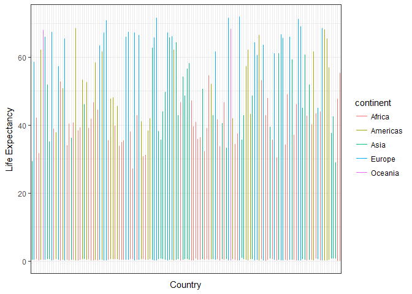<!-- -->

Here's a visual display of all the regression outputs. I couldn't find a reasonable way to keep all of the country names on the plot without it looking awful. I suppose this would be useful for just taking a glance at the variation across countries.


```r
reg_ordered <- arrange(reg_output, desc(estimate))
ggplot(reg_ordered, aes(x=reorder(country, -estimate), y=estimate, color=continent))+
  geom_line(fill="seagreen")+
  labs(x="Country", y="Life Expectancy")+
  theme_bw()+
  theme(axis.text.x=element_blank(),axis.ticks.x=element_blank())
```

```
## Warning: Ignoring unknown parameters: fill
```

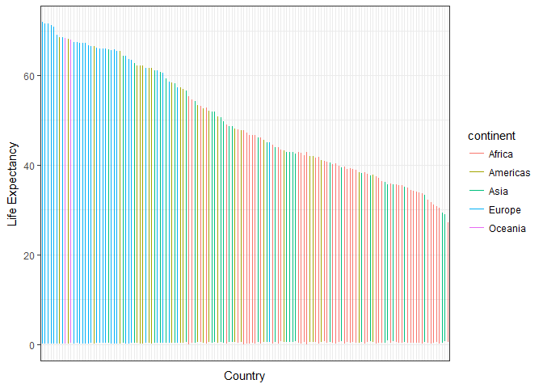<!-- -->

And this graph gives a better since of the variation across the countries because the estimates are shown in a descending order.


```r
reg_ordered <- filter(reg_output, (estimate>1))
ggplot(reg_ordered, aes(x=country, y=estimate, color=continent))+
  geom_point(fill="seagreen")+
  labs(x="Country", y="Life Expectancy")+
  theme_bw()+
  theme(axis.text.x=element_blank(),axis.ticks.x=element_blank())
```

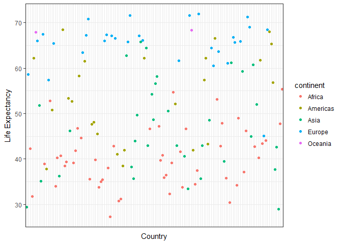<!-- -->
Now that I look back on the tibble I created originally, I'm not quite sure how to optimally analyze it further than I already have. I guess that makes for a good stopping point.

<h4>Process</h4>
<li>I had to do some online research into how for loops work.</li>
<li>Figuring out how to get the right titles onto the automated plots was tricky and took a lot of trial and error. Methods that I thought should have worked simply did not.</li>
<li><a href=http://stat545.com/block024_group-nest-split-map.html> This page </a>was quite useful for the nesting task. Working through it gave me a much better understanding of how nesting works.</li>

