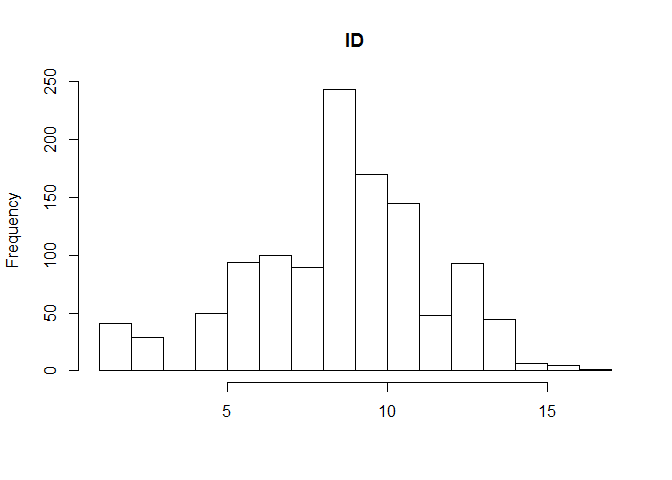

# Homework 6

Welcome to homework 6! For this homework, I've been asked to choose from a list of 6 tasks. I have chosen to do tasks 2 and 6. I'll first be creating my own function and will finish up by exploring nested dataframes.

Prompt:
"Write a couple of experimental functions exploring some functionality that is useful to you in real life and that might form the basis of your personal package."

Because I work in the social sciences, I find myself doing a LOT of copy/pasting ggplot2 code for histograms and barplots. These figures constitute 75% of my "exploratory data analysis," so it would be very useful if I could automate this process. My goal then is to create a function that will produce histograms of every variable in any dataframe that I read into R. Afterwards, I would like to find a way to automate the generation of 2X2 barplots to show interation effects between two or more independent variables and a single dependent variable. Perhaps later this can serve as the basis for an R package of my creation. 

Some people might suggest plotting several histograms at once (in a single panel) using various R packages, but I find this clunky. I like being able to look at each variable in isolation. 

First, I'll read in some data. This is a dataset called EWB light that was collected by personality psychologists.


```r
ewb <- read.table("C:/Users/Wade/Dropbox/Psych 546E 2016/Datasets/ewblight.txt", header=TRUE)
head(ewb)
```

```
##      ID MEANDEP MEANINC MEANPFR MEANSEN ACMPLM36 ADISRM36 AEXPRM36
## 1 10032   10.00    1.44   10.50    7.50       18        9       25
## 2 10061   21.75    1.87   11.00    6.50       24       14       33
## 3 10090      NA      NA      NA      NA       NA       NA       NA
## 4 10111      NA      NA      NA      NA       NA       NA       NA
## 5 10122    8.00    0.85    6.75    8.50       20       11       31
## 6 10146      NA    2.02      NA   13.25       26       14       38
##   BEXTSM36 BINTSM36 BKSTDO36
## 1       23       14        5
## 2       15       17        5
## 3       NA       NA       NA
## 4       NA       NA       NA
## 5       19       13        6
## 6       14       10       14
```


```r
suppressPackageStartupMessages(library(tidyverse))
```

```
## Warning: package 'tidyverse' was built under R version 3.3.3
```

```
## Warning: package 'ggplot2' was built under R version 3.3.3
```

```
## Warning: package 'tibble' was built under R version 3.3.2
```

```
## Warning: package 'tidyr' was built under R version 3.3.2
```

```
## Warning: package 'readr' was built under R version 3.3.3
```

```
## Warning: package 'purrr' was built under R version 3.3.3
```

```
## Warning: package 'dplyr' was built under R version 3.3.2
```

```r
suppressPackageStartupMessages(library(reshape2))
```

```
## Warning: package 'reshape2' was built under R version 3.3.3
```

```r
suppressPackageStartupMessages(library(psych))
```

```
## Warning: package 'psych' was built under R version 3.3.3
```

```r
# Psych is an R package developed for psychologists. It's mostly used to print tables of 
# summary statistics that are commonly used in psychology.
```

For loops follow the following syntax:

for (var in seq) {
  expr
}

That is to say: For each variable in this sequence (or each element in this set), execute this expression.

You can also insert a break statement if you don't want the for loop to be performed on the entire sequence. Ex:

for (var in seq) {
  if (nchar(var) > 10) {
  break
  }
  expr(var)
}
 
You can use "next" instead of break if you want to skip a variable. 


```r
names <- names(ewb)
names(ewb)
```

```
##  [1] "ID"       "MEANDEP"  "MEANINC"  "MEANPFR"  "MEANSEN"  "ACMPLM36"
##  [7] "ADISRM36" "AEXPRM36" "BEXTSM36" "BINTSM36" "BKSTDO36"
```

```r
classes<-sapply(ewb, class)
```


```r
for(name in names) {
 hist(ewb[,name])
}
```

<!-- --><!-- --><!-- --><!-- --><!-- --><!-- --><!-- --><!-- --><!-- --><!-- --><!-- -->

This code appears to work, but the titles are all messed up. I have to use a for loop with a different syntax to put the column names on the graphs.


```r
for (i in 1:11) {
  hist(ewb[,name],
       main = paste(colnames(ewb)[i]),
       xlab = "") 
}
```

<!-- --><!-- --><!-- --><!-- --><!-- --><!-- --><!-- --><!-- --><!-- --><!-- --><!-- -->

Perfect! Now I have code that will generate histograms for every variable in a dataset. It may not look like it, but finding the right code for this took me a surprisingly long time.

Next, let's try to implement ggplot2 instead of just using base R. We'll explore this in the context of 2X2 interaction bar plots.


```r
?paste 
```

```
## starting httpd help server ... done
```

```r
(paste(ewb$name))
```

```
## character(0)
```

```r
paste(colnames(ewb))
```

```
##  [1] "ID"       "MEANDEP"  "MEANINC"  "MEANPFR"  "MEANSEN"  "ACMPLM36"
##  [7] "ADISRM36" "AEXPRM36" "BEXTSM36" "BINTSM36" "BKSTDO36"
```


<h4>Process</h4>
I had to do some online research into how for loops work.

